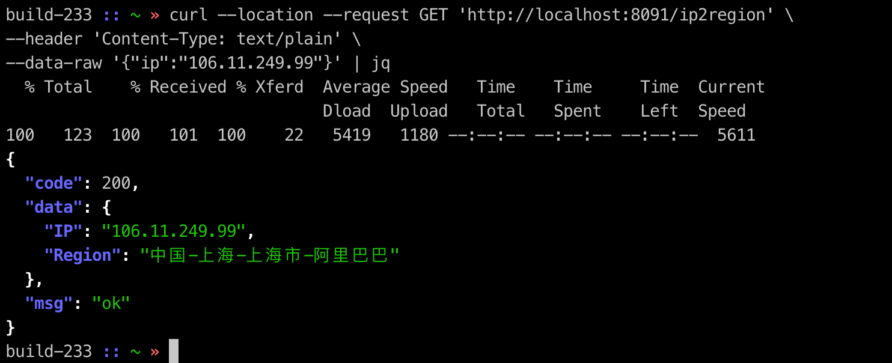

# go-ip2region

### Run

```` shell script
# mac @ adouMBP in ~/goProject/src/github.com/go-ip2region on git:main x [22:47:58] C:1
$ go run main.go
INFO[0000] Listening on ===> :8080                      
INFO[0001] [util - ip2region] | IP ===> 106.11.249.99 | Area ===> 中国-上海-上海市-阿里巴巴 
[GIN] 2020/11/24 - 22:48:03 | 200 |   14.145675ms |             ::1 | GET      "/ip2region"
INFO[0008] [util - ip2region] | IP ===> 103.239.206.29 | Area ===> 中国-广东省-广州市-联通 
[GIN] 2020/11/24 - 22:48:09 | 200 |    5.426055ms |             ::1 | GET      "/ip2region"
````

### Demo



